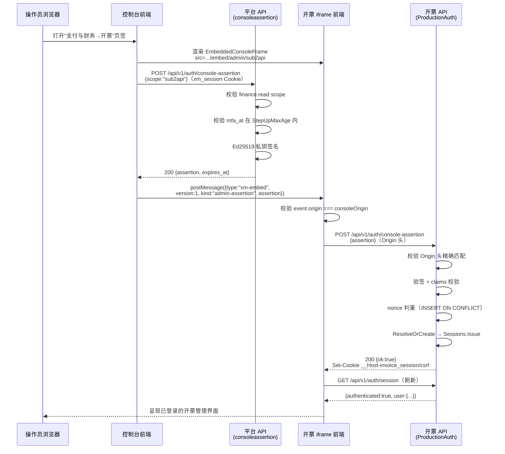
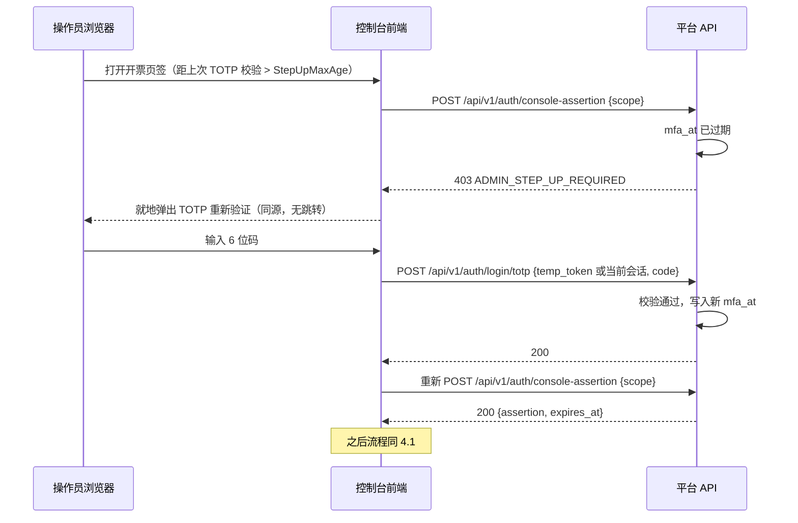
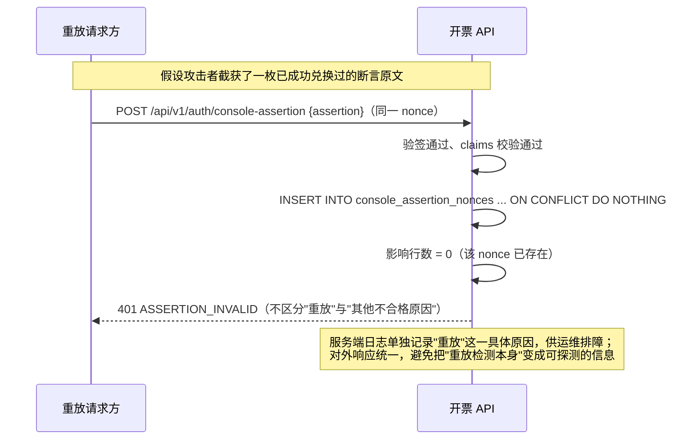
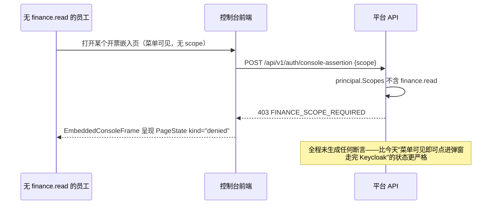

# CR-0006 控制台断言登录技术规格

> **状态：设计阶段，不是实现授权。** 本文冻结控制台（xingmang-platform）与开票系统（invoice-system）之间"断言签发→postMessage 转交→兑换会话"这一条链路的契约细节，供两侧切片（XM-AUTH-TOTP0、XM-INVCON1、XM-INV-CONSOLE-ASSERT、XM-INV-KEYCLOAK-RETIRE）实现时对齐。它不授权部署、不授权对 `invoice_users` 做数据迁移、不授权停用 Keycloak——这些由 `docs/change-requests/CR-0006-console-auth-for-invoice-admin.md` 本体与各切片各自的批准流程管理。

## 1. 结论与范围

新增一条单向信任链：**控制台已认证会话 → 签名断言（≤5 分钟）→ 开票会话**。两侧现有的会话/权限判定代码保持不变，只新增"断言"这一种新的会话签发来源，与今天"OIDC 回调"并列。

范围**不包含**：Keycloak 容器本身的下线操作、`invoice_users` 数据迁移的执行、发布门禁脚本的代码改动——这些是后续切片按本规格实现后各自提交、各自评审的内容，本文档只固定它们必须遵守的接口形状。

## 2. 组件与信任边界

```text
┌─────────────────────────────┐         ┌──────────────────────────────┐
│ console.solov.cc（星芒控制台）│         │ invoice.solov.cc（开票系统）    │
│                               │         │                                │
│  operator browser session    │         │                                │
│  (xm_session cookie,          │         │                                │
│   core.staff_session,         │         │                                │
│   argon2id + TOTP)            │         │                                │
│         │                     │         │                                │
│         ▼                     │         │                                │
│  POST /api/v1/                │         │                                │
│    auth/console-assertion    │         │                                │
│  (新增, internal/platform/     │         │                                │
│   consoleassertion)           │         │                                │
│         │ Ed25519 私钥签名     │         │                                │
│         │ (secret://console-  │         │                                │
│         │  assertion/*)       │         │                                │
│         ▼                     │         │                                │
│  {assertion, expires_at}      │         │                                │
│         │                     │         │                                │
│         ▼                     │         │                                │
│  EmbeddedConsoleFrame          │  iframe │  /embed/admin/<sub2api|newapi  │
│  postMessage(kind=            │────────▶│   |global>                    │
│   "admin-assertion")          │  (跨源) │         │                      │
└─────────────────────────────┘         │         ▼                      │
                                          │  POST /api/v1/                │
                                          │    auth/console-assertion    │
                                          │  (新增, ProductionAuth)        │
                                          │  Ed25519 公钥验签              │
                                          │  (contracts/auth/console-     │
                                          │   assertion-keyring.v1.json)  │
                                          │         │                      │
                                          │         ▼                      │
                                          │  Set-Cookie                    │
                                          │   __Host-invoice_session       │
                                          │   __Host-invoice_csrf          │
                                          └──────────────────────────────┘
```

信任边界跨越点只有一处：**断言本身**，从控制台进程边界（有私钥）传到开票进程边界（有公钥）。两侧其余状态（`core.staff_session` 与 `auth_sessions`）互相不可见、不共享数据库、不共享网络路径——与 ADR-018 "平台不拥有开票业务真相、不直写开票原表"的既有边界完全一致，本设计新增的是一条**认证握手**，不是数据通道。

## 3. 断言契约

### 3.1 编码

JWS Compact Serialization，`{header}.{payload}.{signature}`，均 base64url 无填充。

Header：
```json
{"alg":"EdDSA","kid":"<key_id>","typ":"xm-console-assertion+jwt"}
```

`typ` 使用专属值（不是裸 `JWT`）——防止这枚令牌被误用/误接受在其他任何期待普通 `JWT`/`at+jwt` 的校验器上，是域分离的第一道防线，呼应 `fleet_keyring.go` "签名域不能跨子系统复用"的既有设计原则。

### 3.2 Claims

| claim | 类型 | 约束 | 说明 |
|---|---|---|---|
| `iss` | string | 精确等于 `https://console.solov.cc` | 与开票 `PostgresIdentityStore.ResolveOrCreate` 的 `validateExactHTTPSURL(principal.Issuer, true)` 校验直接兼容 |
| `aud` | string | 精确等于 `xingmang-console-assertion-v1` | 固定字符串，不是 URL；开票侧按精确相等比较，不接受数组或前缀匹配 |
| `sub` | string | `core.staff_account.id`（UUID 文本） | 身份键；开票侧 `Principal.Subject` |
| `username` | string | ≤128 UTF-8 字节 | 展示用，非身份键 |
| `roles` | string[] | 子集⊆`core.staff_account.roles` | 供开票侧 `AdminPolicy.Role` 精确匹配（今天是单角色判定，`slices.Contains(session.Roles, p.Role)`） |
| `acr` | string | 精确等于 `xingmang-console-totp-v1` | 开票侧 `OIDC_REQUIRED_ADMIN_ACR` 需同步配置为此值 |
| `amr` | string[] | 至少含 `pwd`、`otp` | `otp` 存在即代表签发时刻 `mfa_at` 新鲜度已验证——不再由开票侧重新验证 TOTP，开票信任控制台已经验证过 |
| `scope` | string | ∈ `{sub2api, newapi, global}` | 审计与展示字段，见 CR-0006 正文"不是新授权边界"的裁定 |
| `nonce` | string | 32 字节随机值的 base64url，43 字符 | 一次性重放保护标识；同时承担 JWT `jti` 角色，不重复定义两个字段 |
| `iat` | number | Unix 秒 | 签发时刻 |
| `exp` | number | `iat < exp ≤ iat + 300` | 严格上限 300 秒；开票侧对声称更长有效期的断言直接拒绝，不只是"以 300 秒为准" |
| `nbf` | number | 等于 `iat` | 显式声明生效时刻，避免依赖"不存在即生效"的隐式语义 |

时钟容忍：开票侧校验 `iat`/`exp`/`nbf` 时允许 ±60 秒时钟偏移（与 `oidcauth`/开票 `AdminPolicy` 现有的 `defaultClockSkew` 惯例一致），但**不放宽** `exp - iat ≤ 300` 这条结构性约束本身（时钟偏移只影响"现在几点"的判断，不影响令牌自称的有效期上限）。

### 3.3 签名与密钥托管

算法固定 Ed25519（`EdDSA`），不支持算法协商（拒绝任何 `alg` 不等于 `EdDSA` 的断言，防止经典的"改成 `alg:none`"或降级攻击）。

私钥：控制台服务端持有，经 `secret://console-assertion/signing-key-<key_id>` 引用、通过既有 `SecretProvider`/`CredentialRef` 间接寻址（ADR-014），启动时加载进内存，不落日志、不落 HTTP 响应、不进 AI 上下文。一个 `key_id` 对应一把私钥，键名里的日期或序号建议由运维在生成时约定（如 `2026-09`），不在本规格里固定格式。

公钥分发：**评审过的静态清单文件**，不采用实时 JWKS 端点。理由：

1. 本仓库已有同构先例（`internal/platform/jobs/fleet_keyring.go`）证明这个模式在生产可用；
2. 两个系统由同一团队维护、已经通过 `docs/change-requests/` 协调发布节奏，不需要运行时发现机制解决的是"互不相识的多租户"问题，这里不存在；
3. 不新增一条"开票必须能实时访问控制台某端点才能验证登录"的运行时依赖——JWKS 方案会让开票的登录可用性隐性绑定到控制台的可用性，静态清单方案不会。

代价（如实记录，供产品负责人在 CR-0006 正文的确认段落里权衡）：轮换密钥需要两侧各一次代码评审 + 发布，不能靠运维改一个配置项瞬时生效。

清单文件形状（`contracts/auth/console-assertion-keyring.v1.json`，两仓库各存一份只读副本）：

```json
[
  {
    "key_id": "2026-09",
    "algorithm": "Ed25519",
    "public_key": "<32字节公钥的标准base64>",
    "fingerprint": "<公钥sha256的hex>",
    "purpose": "console_admin_assertion_signing",
    "protocol": "xm-console-assertion-v1",
    "valid_from": "2026-09-15T00:00:00Z",
    "valid_until": "2027-09-15T00:00:00Z",
    "revoked_at": null,
    "revoke_reason": ""
  }
]
```

字段语义、校验规则（禁止重复 `key_id`、禁止公钥material 复用、`valid_from < valid_until`、UTC 时间、撤销必须早于到期）**直接复用** `fleet_keyring.go` 里 `JobFleetTrustedKey`/`NewJobFleetKeyring` 已经实现并测试过的规则集，只是把 `purpose`/`protocol` 换成本设计专属的值（域分离：一把断言签名钥匙不能被拿去冒充一份 job fleet 清单，反之亦然）。开票侧按 `(key_id, purpose, protocol, signedAt)` 四元组查找可信公钥，`signedAt` 落在 `[valid_from, valid_until)` 且早于 `revoked_at`（若有）才算可信——同样直接复用 `Lookup` 的既有语义。

轮换流程：新增一条 `valid_from` 在未来的记录（与旧记录重叠一段窗口，建议 ≥1 天，覆盖两侧发布的时间差）→ 两仓库各自评审、发布 → 私钥切换生效后旧公钥记录补 `revoked_at`（不删除记录，保留用于审计历史断言的可验证性）。

### 3.4 请求体（控制台断言签发）

```http
POST /api/v1/auth/console-assertion HTTP/1.1
Host: console.solov.cc
Cookie: xm_session=...
X-Requested-With: xingmang

{"scope":"sub2api"}
```

响应：

```json
{"assertion":"eyJhbGciOi...", "expires_at":"2026-09-15T10:04:00Z"}
```

### 3.5 请求体（开票兑换）

```http
POST /api/v1/auth/console-assertion HTTP/1.1
Host: invoice.solov.cc
Origin: https://console.solov.cc
Content-Type: application/json

{"assertion":"eyJhbGciOi..."}
```

成功响应：`200 {"ok":true}`，附 `Set-Cookie: __Host-invoice_session=...`、`Set-Cookie: __Host-invoice_csrf=...`（与今天 OIDC 回调成功后 `setSessionCookies` 产生的两个 Cookie 完全同形）。**不做 HTTP 重定向**——这是一次由 iframe 内 `fetch` 发起的后台调用，不是浏览器顶层导航，调用方（iframe 前端）负责在拿到 `{"ok":true}` 后自行触发既有的 `GET /api/v1/auth/session` 刷新界面状态。

## 4. 时序图

### 4.1 正常登录



### 4.2 步进（TOTP 新鲜度过期）



### 4.3 重放拒绝



### 4.4 越权签发拒绝



## 5. HTTP 端点与错误码

### 5.1 控制台侧（平台）

| 端点 | 方法 | 鉴权 | 说明 |
|---|---|---|---|
| `/api/v1/auth/console-assertion` | POST | 需 `xm_session` + CSRF 头 | 签发断言 |
| `/api/v1/auth/login/totp` | POST | 需已完成密码校验的临时态 | 完成 TOTP 二步登录 |
| `/api/v1/auth/totp/enroll` | POST | 需 `xm_session` + CSRF 头 | Action `staff.account.enroll_totp`，返回一次性 `otpauth://` URI |
| `/api/v1/auth/totp/confirm` | POST | 需 `xm_session` + CSRF 头 | Action `staff.account.confirm_totp`，返回一次性恢复码列表 |

错误码（控制台侧，均沿用 `httpapi.ErrorResponse` 既有信封）：

| HTTP | code | 触发条件 |
|---|---|---|
| 401 | `PERMISSION_DENIED` | 缺少或无效的 `xm_session` |
| 403 | `FINANCE_SCOPE_REQUIRED` | principal 缺少 `finance.read` |
| 403 | `ADMIN_NETWORK_DENIED` | 请求方 IP 不在 `XM_CONSOLE_ADMIN_IP_ALLOWLIST` |
| 403 | `ADMIN_STEP_UP_REQUIRED` | `mfa_at` 超出 `StepUpMaxAge` |
| 400 | `INVALID_PARAMS` | `scope` 不在三个允许值内、请求体不是合法 JSON |
| 500 | `INTERNAL` | 签名/仓储失败 |

### 5.2 开票侧

| 端点 | 方法 | 鉴权 | 说明 |
|---|---|---|---|
| `/api/v1/auth/console-assertion` | POST | 需精确 `Origin` 头，无需预先会话 | 兑换断言为会话 |

错误码（开票侧，沿用既有 `writeError` 信封）：

| HTTP | code | 触发条件 |
|---|---|---|
| 400 | `ASSERTION_MALFORMED` | 请求体不是合法 JSON、`assertion` 字段缺失或不是 JWS 三段式 |
| 403 | `ORIGIN_REJECTED` | `Origin` 头缺失、多值或不精确等于 `https://console.solov.cc` |
| 401 | `ASSERTION_INVALID` | **统一覆盖**：签名错误、`kid` 未知/已撤销、`iss`/`aud`/`acr` 不匹配、`exp`/`nbf`/`iat` 不合法、`roles` 不含所需角色、nonce 重放——刻意不进一步细分，理由见 4.3 图注与下方"设计取舍" |
| 429 | `RATE_LIMITED` | 兑换端点自身的按 IP 限流（沿用 `localauth` 登录端点的限流量级：20/分钟、突发 10） |
| 500 | `INTERNAL` | 仓储/会话签发失败 |

**设计取舍——为什么 `ASSERTION_INVALID` 不区分重放与其他原因**：本仓库在 OIDC 令牌校验（`msgInvalidToken`）、本地会话查找（`ErrSessionInvalid`）、登录密码校验（`INVALID_CREDENTIALS` 统一覆盖"用户不存在"与"密码错误"）三处都采用同一条纪律——对外一种失败、服务端日志留存具体原因。让"重放"单独可辨会把这个端点变成一个免费的"这个 nonce 是不是已经被用过"探测接口，与既定纪律矛盾，因此本设计沿用统一覆盖，不引入例外。

## 6. 数据库改动（供实现参考，非本规格授权执行）

### 6.1 控制台侧（xingmang-platform）

`core.staff_account` 新增列：`totp_secret_ref TEXT`（可空，`secret://staff-totp/<id>` 形态）、`totp_enrolled_at TIMESTAMPTZ`（可空）、`must_enroll_totp BOOLEAN NOT NULL DEFAULT false`。

`core.staff_session` 新增列：`mfa_at TIMESTAMPTZ`（可空）。

新表 `core.staff_totp_recovery_code`：

```text
account_id  UUID NOT NULL REFERENCES core.staff_account(id)
code_hash   CHAR(64) NOT NULL  -- sha256 hex
created_at  TIMESTAMPTZ NOT NULL
used_at     TIMESTAMPTZ         -- NULL = 未使用
PRIMARY KEY (account_id, code_hash)
```

### 6.2 开票侧（invoice-system）

新表 `console_assertion_nonces`：

```text
nonce_hash   CHAR(64) PRIMARY KEY CHECK (nonce_hash ~ '^[0-9a-f]{64}$')
consumed_at  TIMESTAMPTZ NOT NULL
expires_at   TIMESTAMPTZ NOT NULL  -- 等于断言的 exp，用于保留期清理
```

保留期任务：仿 `internal/oidcretention` 现有模式，定期清理 `expires_at < now() - 1 hour` 的行——过期断言不可能再被成功验签（`exp` 校验会先行拒绝），保留一小时纯粹是为排障留窗口，不是安全需要。

`invoice_users` 表结构不变（`oidc_issuer`/`oidc_subject`/`UNIQUE` 约束原样复用，只是这一行的取值来源从 Keycloak 换成控制台）。

## 7. 审计字段

控制台侧新增审计事件 `staff.console_assertion.issue`（走既有 `audit.Store.Append`，`ActionID` 沿用同一命名风格但注明不经 `action.Registry`）：

| 字段 | 值 |
|---|---|
| `PrincipalID` | `staff:<username>` |
| `ResourceType` | `console_assertion` |
| `ResourceID` | 断言的 `nonce`（截断展示，完整值不落审计） |
| `CompensationResult`（失败时复用此字段记原因） | `finance_scope_missing` \| `step_up_required` \| `ip_denied` |
| 附加字段 | `scope`（sub2api/newapi/global） |

开票侧复用既有 `insertSecurityAudit`（`auth.identity.create`/等价的登录事件），`ActorType` 新增取值 `console_assertion`（区别于既有的 `oidc`/`platform`），`ActorID` 为 `principal.IdentityHash()`（即 `sha256(iss+"\n"+sub)`，与今天 OIDC 登录审计的 `ActorID` 计算方式完全相同，不需要新逻辑）。

运维层面建议（非强制）：定期核对控制台侧 `staff.console_assertion.issue` 成功计数与开票侧 `console_assertion` 类型审计事件计数是否吻合——持续性的"签发数远大于兑换数"或反向，是检测滥用/故障的低成本信号。

## 8. 威胁模型

| 威胁 | 攻击面 | 缓解措施 | 残余风险 |
|---|---|---|---|
| **断言被窃取**（XSS、恶意扩展读取了 postMessage 内容或网络层截获） | 断言在 5 分钟内、且未被兑换过之前，等价于一枚开票管理员会话的引导凭据 | ①`exp≤5分钟`大幅缩窄窗口；②`aud` 绑定防止挪作他用；③nonce 一次性消费，先到先得；④开票侧 `Origin` 头精确校验——攻击者要想用窃取到的断言完成兑换，必须能从 `https://console.solov.cc` 这个精确源发起请求，浏览器的 `Origin` 头不可被脚本伪造 | 若攻击者已经能在 `console.solov.cc` 源上执行任意脚本（即控制台本身被 XSS），则 Origin 校验形同虚设——见"控制台被攻陷"一行，这不是一个独立的新风险类别，是同一根因的另一种后果 |
| **重放**（同一枚断言被使用两次） | 5 分钟窗口内，若第一次兑换后断言原文仍可被第三方获得 | nonce 表的 `INSERT ... ON CONFLICT DO NOTHING` 提供原子的"先到先得"判重，不存在 TOCTOU 竞态 | 并发到达的两个兑换请求中，落败的一方获得 `ASSERTION_INVALID`——这是预期行为，不是缺陷；若落败的恰好是合法 iframe 自己（例如网络重试导致的自我竞态），前端需要能优雅处理"断言已失效，请重新触发签发"而不是死循环重试同一枚断言 |
| **iframe 来源伪造**（恶意页面试图让开票 iframe 接受伪造的断言消息，或诱导真实控制台把断言发给错误的 frame） | postMessage 的目标/来源校验 | ①开票 iframe 侧的消息监听器校验 `event.origin === 预期的控制台来源`，非此来源的消息一律丢弃；②`EmbeddedConsoleFrame` 只会把消息 `postMessage` 到它自己创建、且 `targetOrigin` 精确指定为 `invoiceConsoleOrigin` 的那个 `contentWindow`——若该 frame 已导航离开预期来源，浏览器按 postMessage 规范本身就不会投递；③开票 `/admin` 路由的 `frame-ancestors https://console.solov.cc`（XM-INV-ADMIN-EMBED 已上线）确保恶意页面从一开始就无法把开票管理页装进自己的 frame，也就没有"错误的 frame"可供控制台意外发送 | 无实质残余——三层缓解分别独立生效，需要同时攻破全部三层（且其中两层是浏览器同源策略本身提供的保证，不依赖本设计代码是否写对）才能构造出可用的伪造路径 |
| **控制台自身被攻陷**（攻击者获得 console.solov.cc 的代码执行或管理员权限） | 最严重情形：攻击者可能能签发任意断言，或劫持一个已完成 TOTP 步进的真实操作员会话去触发签发 | ①私钥只存在服务端进程可达位置（经 `SecretProvider` 间接寻址），单纯的前端 XSS 不直接获得私钥，需要服务端层面的攻陷；②每次签发都在两侧留下独立审计记录，即便签发环节被滥用，开票侧仍保有一份独立时间线；③清单文件的 `RevokedAt` 机制使密钥泄露的止损不需要重新部署信任链——撤销一条记录、发布，两侧同时生效 | 这与今天"Keycloak 被攻陷"是同一等级的风险（都是"身份源头不可信"），本设计**没有引入新的风险类别**，只是把这个信任集中点从 Keycloak 换成了控制台自身——本身已经是承载全部平台管理权限的系统，防护要求不因本 CR 而提高或降低 |

## 9. 测试矩阵

| # | 场景 | 期望结果 |
|---|---|---|
| 1 | 合法断言，首次兑换 | 200，成功建立开票会话，`invoice_users` 命中已迁移的既有行 |
| 2 | 合法断言，第二次兑换（重放） | 401 `ASSERTION_INVALID`，第一次建立的会话不受影响 |
| 3 | `exp` 超过签发 5 分钟 | 401，即使签名合法 |
| 4 | `exp`/`iat`/`nbf` 在 ±60 秒时钟偏移内 | 200（容忍边界内） |
| 5 | `exp - iat` 声称为 6 分钟但签名合法 | 401（结构性上限拒绝，不因签名合法而放行） |
| 6 | 篡改 payload 任意一个字段后重新 base64（未重签） | 401，签名校验失败 |
| 7 | `aud` 不等于 `xingmang-console-assertion-v1` | 401 |
| 8 | `iss` 不精确等于 `https://console.solov.cc`（如带尾斜杠、大小写不同） | 401 |
| 9 | `kid` 不在当前清单中 | 401 |
| 10 | `kid` 命中已 `revoked_at` 的记录，且断言 `iat` 晚于撤销时刻 | 401 |
| 11 | `kid` 命中"下一把"尚未到 `valid_from` 的记录 | 401（未生效） |
| 12 | `alg` 字段被改为 `none` 或 `HS256` | 401（拒绝任何非 `EdDSA`，不做算法协商） |
| 13 | 请求缺少 `Origin` 头 | 403 `ORIGIN_REJECTED` |
| 14 | `Origin` 头出现两次（代理合并异常） | 403（要求恰好一个值） |
| 15 | `Origin` 值精确但协议为 `http` | 403 |
| 16 | 控制台侧：principal 无 `finance.read` | 403 `FINANCE_SCOPE_REQUIRED`，不产生任何断言 |
| 17 | 控制台侧：`mfa_at` 超出 `StepUpMaxAge` | 403 `ADMIN_STEP_UP_REQUIRED` |
| 18 | 控制台侧：请求方 IP 不在允许名单 | 403 `ADMIN_NETWORK_DENIED` |
| 19 | 开票侧兑换端点短时间大量请求 | 429 `RATE_LIMITED` 生效，合法用户不被误伤（独立按来源 IP 分桶） |
| 20 | 断言体积异常（远超正常 JWT 长度） | 400，请求体大小上限先行拒绝 |
| 21 | 并发：同一 nonce 的两个兑换请求几乎同时到达 | 恰好一个成功，另一个 401，无数据竞态、无重复会话 |
| 22 | 数据迁移前后对照：same `invoice_users.id` | 迁移执行后用新断言登录，落在同一行而非新建行；历史工单/审计仍可查到该行 |
| 23 | 并存期回归：Keycloak OIDC 路径 | 独立入口 `invoice.solov.cc/admin` 的 OIDC 登录不受本次改动影响，功能与今天一致 |
| 24 | 第二阶段：`OIDC_ADMIN_LOGIN_ENABLED=false` 后 | OIDC 路由不再注册（或返回明确的"已retired"错误），断言路径独立完整工作 |
| 25 | 第二阶段：发布门禁 `IdPMode=console-assertion` | 镜像清单恰好八个且不含 `invoice-keycloak`；`IdPMode=none`/`keycloak`/`external-managed` 三个既有取值行为不受影响 |
| 26 | 第二阶段：`restore-drill.sh` 关闭 `KEYCLOAK_BACKUP` | 非 Keycloak 备份集合独立可完整恢复，不报错、不缺组件 |
| 27 | TOTP 恢复码：使用一次 | 登录成功，该码标记 `used_at`，再次使用同一码被拒绝 |
| 28 | TOTP 恢复码：全部用尽 | 触发"仅剩另一管理员可 `reset_totp`"或 Platform Lifecycle Operation 的既定路径，不留静默死锁 |

## 10. 与现有代码的接口点（供实现者定位，非穷举）

- 平台：`internal/platform/localauth/*`（TOTP 扩展）、新增 `internal/platform/consoleassertion/*`、`internal/platform/jobs/fleet_keyring.go`（可直接抽取其 `JobFleetTrustedKey`/`NewJobFleetKeyring`/`LoadJobFleetKeyringJSON` 模式为独立的通用小工具，供两个签名域共用底层代码，是否抽取留给实现者判断，不强制）、`web/packages/ui-admin/src/EmbeddedConsoleFrame.tsx`。
- 开票：`backend/internal/auth/*`（新增断言校验与静态 keyring 装配，紧邻现有 `bearer.go`/`oidc.go`）、`backend/internal/httpapi/production_auth.go`（新增 `Register` 路由与 handler，紧邻现有 `callback`）、`backend/cmd/api/runtime.go`（新增装配，紧邻现有 `oidcConfig`/`adminPolicy` 构造处）、`backend/migrations/`（新增迁移文件，从下一个可用序号开始）、`web/src/App.tsx`/`AuthProvider.tsx`（新增入站 `postMessage` 监听，替换今天 embedded-admin 模式下的弹窗触发逻辑）。
- 两仓库共享：`contracts/auth/console-assertion-keyring.v1.json`（新增，公钥清单）。
